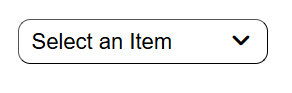
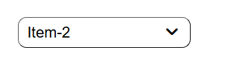
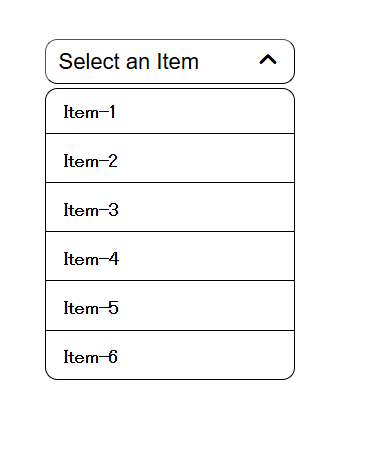
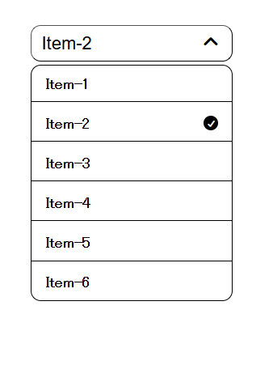

# Custom Dropdown Menu

A lightweight custom dropdown component built with vanilla HTML, CSS, and JavaScript — no frameworks or libraries required (except Font Awesome for icons).

## Live Demo
[View Live]

## Preview

## Features
- Default state with placeholder text
- Smooth open/close animation using max-height transition
- Selected item highlighted with a checkmark icon
- Arrow icon rotates on open/close
- Closes when clicking outside the dropdown

## Technologies Used
- HTML5
- CSS3 (transitions, flexbox)
- JavaScript (Vanilla)
- Font Awesome 7 (icons)

## Project Structure
custom-dropdown/
├── index.html    # Dropdown structure and markup
├── style.css     # Styling and animations
└── script.js     # Dropdown logic and event handling

## How It Works
1. Click the trigger button to open the dropdown
2. Select any item from the list
3. Selected item is highlighted with a checkmark
4. Trigger button updates to show the selected item
5. Dropdown closes automatically after selection

## How to Run Locally
1. Clone the repo
   git clone https://github.com/Punxxet/custom-dropdown.git
2. Open `index.html` directly in your browser — no setup needed

## Author
Puneet Jadaun
- GitHub: [@Punxxet](https://github.com/Punxxet)